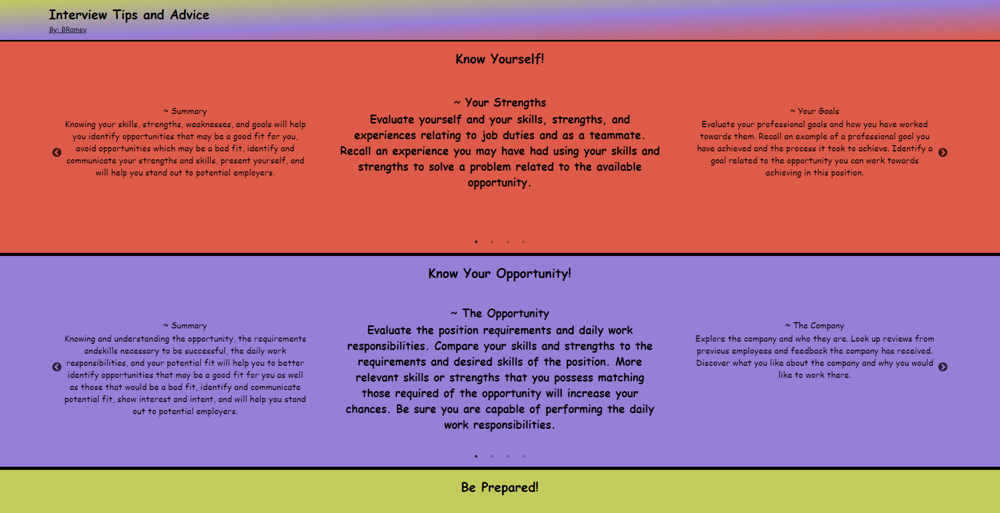

# Interview Preparation Tips and Advice

Tips and advice to help you prepare and to best present yourself in an interview!
Includes sections to help you identify your own strength and weaknesses, identify
why you should be chosen, and to go into the interview confident and present.

### Available Scripts

`npm start`

Runs the app in the development mode.\
Open [http://localhost:3000](http://localhost:3000) to view it in your browser.

`npm test`

Launches the test runner watch mode.

A React Project By: B Ramey
